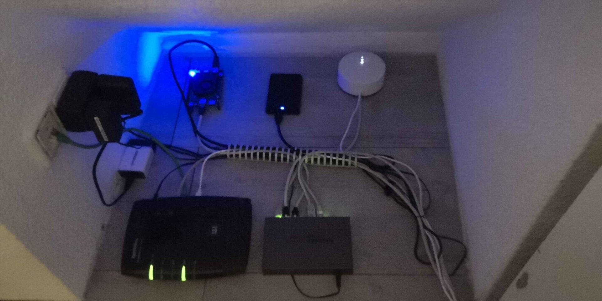
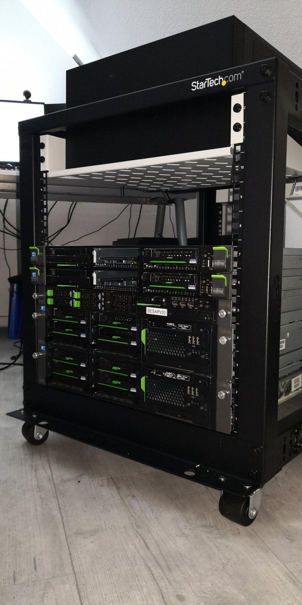
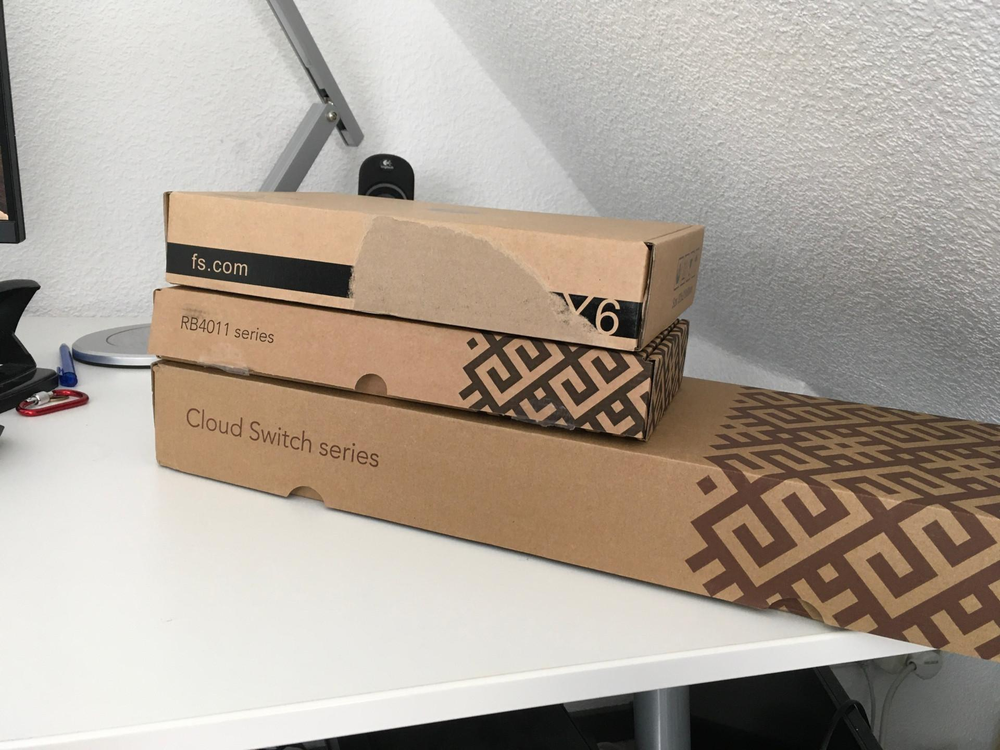
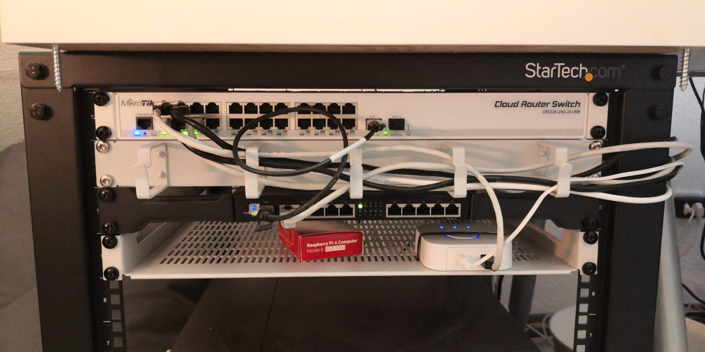
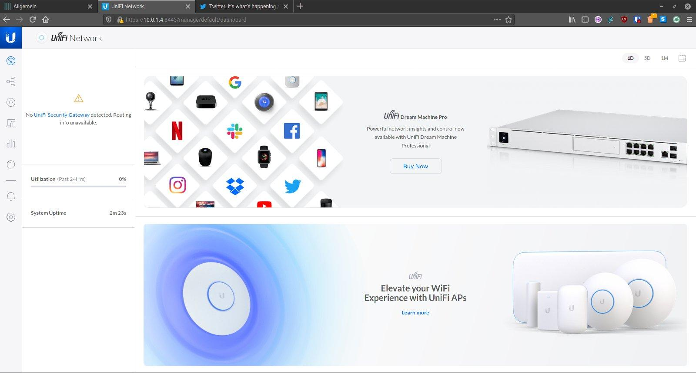
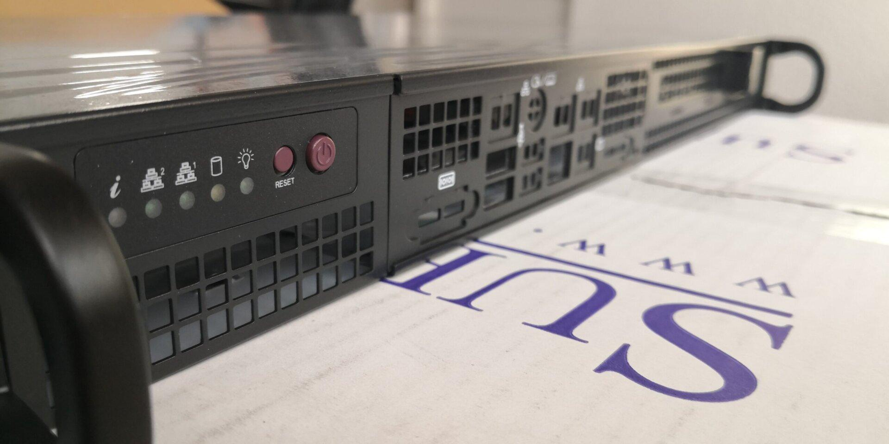
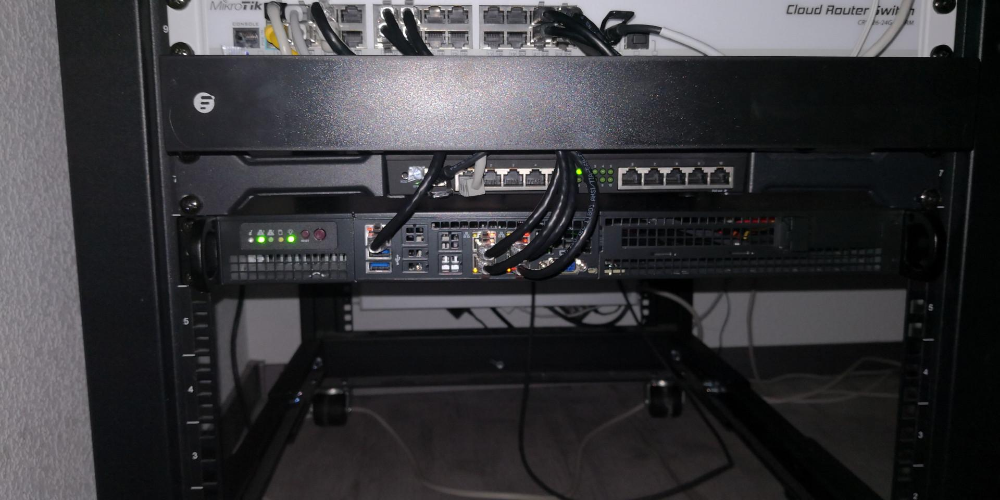
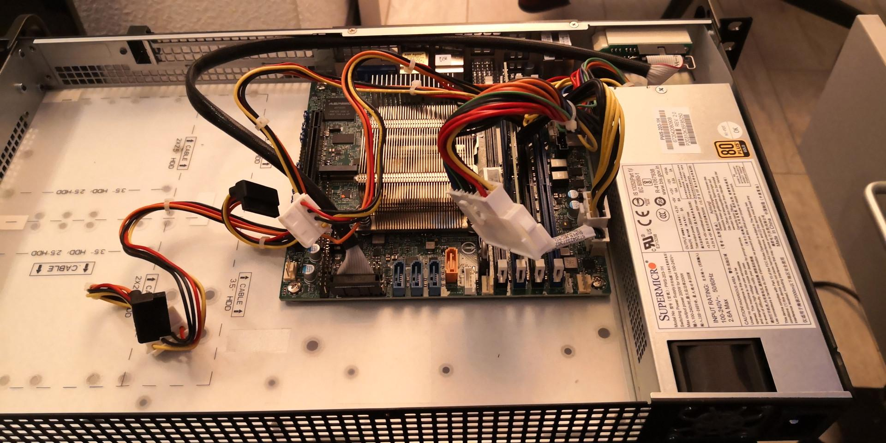
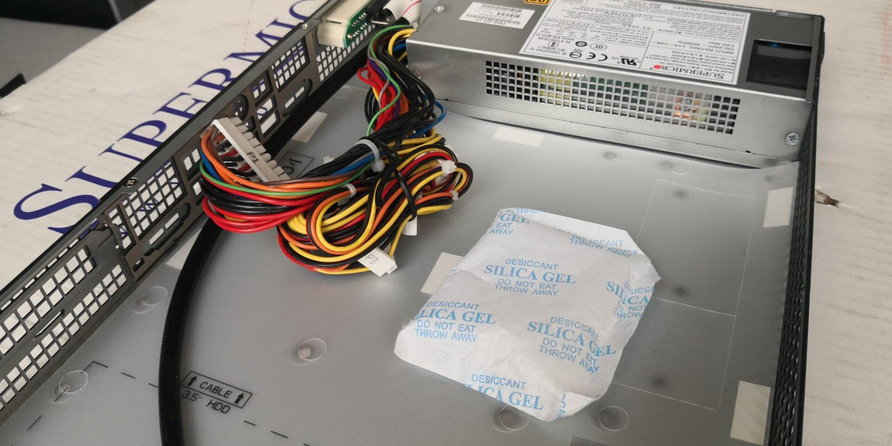

In the beginning, there was… well, nothing. After playing around with desktop computers, servers, and many, many VMs as long as I can think, I never really managed to permanently self-host something myself. This post is just part of its evolution.

> Most information in this post is outdated by now, check out my follow-up posts!

## Homelab v0 - The Introduction

This all started to change back in 2015 when I heard of a wonderful software called Plex, and decided that I want to host it for me and close friends. I believe Plex is one of the biggest reasons people stuff servers into their homes. At that point I had multiple servers laying around, and while they were some of the more quiet ones (Fujitsu RX100/RX200/RX300), they were still too loud to leave them running a few meters next to my bed. So, what was the most quiet computer I owned at that time? A Raspberry PI 2b with some ARM Plex distribution that’s normally intended to be integrated into NAS systems. Running Plex on a RPI2B may sound like a terrible idea, but it worked… somehow. I only had to remember to convert all video files to h264 before I put them onto the 1Tb external hard drive connected via USB 2.0 to it.

On the networking side of things, all of this ran behind an EdgeRouter X, a great device for the price. Sad that Ubiquiti seems to deprecate the Edge series.

This setup was not great… but it was my Homelab v0. The starting point of many future expenses.

## Homelab v1 - The Getting Started

At one point, I came to the conclusion, that a single RPI wouldn’t cut it, although its form factor wasn’t that bad. So after searching for more-powerful, x86-based SBCs online, I decided to go with the [Lattepanda Alpha 864](https://www.lattepanda.com/products/lattepanda-alpha-864s.html). (The product in this link is the updated version 864s with a different CPU, mine has the Intel M3-7y30 as used in some MacBook models.) It features a good-enough Intel Dual-Core/Quad-Thread CPU with virtualization capabilities, 8Gb of RAM, and 64GB eMMC storage. One quick Plex migration later and I had a working, somewhat powerful media server.

I also used it for VPN access to my home network (although there weren’t many devices on it back then). Since I am on a residential network with a DHCP-assigned WAN IP address, I had to get a domain name. As a poor student I couldn’t/didn’t want to afford a proper domain name, so a DDNS service had to do. After years of trying out different providers I came to the conclusion that (back then) [Dynu](https://www.dynu.com/) had by far the best free tier and supports all standard IP-update protocols without having to run some extra VM.

## Homelab v2 - The First Server

I would say things really started to take off with Homelab v2. Initially I wanted a platform for experimenting with “bigger” VM setups like the VMware ecosystem (vCenter, Horizon View, vSAN, …), the Microsoft ecosystem (Hyper-V, Active Directory, …) and the likes. Also, the 1Tb external HDD started to get full. The trusty Lattepanda Alpha with its 8GB of RAM just wasn’t enough for all of this, and after a while of saving I finally pulled the trigger on a whitebox server build. My requirements were, as always, cheap and quiet. I ended up with this:

 

|               | Part                                | Price        | Qty    |
|---------------|-------------------------------------|--------------|--------|
| CPU           | AMD Ryzen 5 2400G                   | 124.90€      | 1      |
| RAM           | G.Skill Aegis DDR4-3000 CL16 16Gb   | 61.90€       | 2      |
| Motherboard   | Gigabyte B450 Aorus M               | 78.99€       | 1      |
| Power Supply  | Thermaltake Berlin 630W             | \-           | 1      |
| Case          | CoolerMaster Silenctio S400         | 85.90€       | 1      |
| SSD           | WD Black SN750 500GB                | 69.90€       | 1      |
| HDD           | Seagate IronWolf 4Tb                | 109.40€      | 2      |
|               | HGST Travelstar 5K1000 1Tb          | \-           | 2      |
| RAID/HBA      | Dell PERC H310                      | 33.90€       | 1      |
| Boot USB      | SanDisk Ultra 32Gb                  | \-           | 1      |
| Total         |                                     | 736.19€      |        |

 

Some parts I had already laying around, like some old 1Tb (now used in RAID0 as scratch storage) and the power supply from an old gaming PC.

This whitebox is running for about a year now, and I am most impressed by the case: It look good, the build quality is absolutely perfect, it was cheap (compared to the Fractal Design cases I looked at first), it has pretty dust filters and it is extremely quiet: The side panels are insulated with about 1cm of foam, and the CoolerMaster standard fans are inaudible compared to the Thermaltake ones in my desktop.

The ESXi installation was almost seamless, except for the NIC drivers: The B450 Aorus M only has a Realtek onboard NIC, but this wasn’t a big problem thanks to the [ESXi image customization script](https://www.v-front.de/p/esxi-customizer-ps.html) and [this guide](https://www.v-front.de/2014/12/how-to-make-your-unsupported-nic-work.html).

The Dell PERC H310 has been flashed to IT mode. I would like to post a more detailed guide on how this is done, but it has been too long ago and there are multiple [great guides out there](https://tylermade.net/2017/06/27/how-to-crossflash-perc-h310-to-it-mode-lsi-9211-8i-firmware-hba-for-freenas-unraid/), even for [dealing with EFI](https://www.vladan.fr/flash-dell-perc-h310-with-it-firmware/). The 2+2 disks were forwarded to a FreeNAS VM and shared via NFS to a Debian-Plex-VM.

The whitebox also replaced my router through an OPNsense VM.

You could call this a “usual”, whitebox homelab setup. Nothing fancy, but still useful.

### Homelab v2.1 - The Rack

This setup ran perfectly for over a year, but it did not offer very much flexibility: The 2+2 disks were assigned to FreeNAS only, and ZFS really was not that necessary since I could not use deduplication.

So a at that time I scrapped everything, flashed the RAID controller back to its original firmware, reinstalled ESXi (this time with vCenter) and installed Plex to a CentOS (back when it still existed) VM, directly connected to a 2.5TB VMDK file on the RAID 1 backed VMFS datastore.

Around that time I also segmented my networks more, having separate VLANs for WAN, internal, DMZ, VPN, and a few “testing” networks. This gives me enough flexibility to try out new technologies, learn for certifications, and hopefully write about them in this blog.

This was the time that I really started to invest money into my homelab. I got myself a [12u open frame rack](https://www.startech.com/de/en/Server-Management/Racks/12u-4-post-server-rack~4POSTRACK12U) from StarTech (which offers amazing build quality) and got to work mounting everything:

Homelab v2. Yes, all the servers are laying on a single pair of rack rails.

If you are looking for an open frame rack, this one seems perfect to me. Just ignore the whitebox server laying on top.

## Homelab v3 - The expenses

Homelab v3 consists of me buying way too much extra stuff, including some network gear (Ubiquiti Dream Nightmare Machine Pro, Unifi AP AC Lite). At least I thought at the time it would be proper gear. In hindsight I should have picked a different firewall/router/switch: The Dream Machine Pro, while fancy on the outside, had buggy software, a slow (1Gbps) backplane, and didn’t offer basic features like disabling NAT. Homelab v3 also consists of me selling my Dream Machine Pro, and getting some proper network gear, namely a MikroTik RB4011 and a MikroTik CRS326. Couldn’t be happier with them. Way more features, performance, for the price that I sold my UDMP for.

A few months later I also sold the AC Lite, because I couldn’t stand the management interface any longer. I mean look at all the ads:

Unacceptable on hardware I paid for and own.

The replacement for the AC Lite is a TP-Link EAP245 v3. Same price, more powerful:

TP-Link EAP245 v3 dangling from a window for 1Gbps WiFi in the garden.

The TP-Link equivalent to Unifi (Omada) also has the exact same web interface as Ubiquiti. I wonder how they got through with that.

I also bought storage gear (Synology DSM218+, in which I threw the IronWolfs) and a few domains. I also put the Fujitsus in storage as I haven’t had a good use for them.

### Homelab v3.1 - Finding The Right Direction

Homelab v3.1… Mostly I just bought stuff on eBay Kleinanzeigen (Craigslist equivalent) and resold it a few months back because I decided I wanted something else.

I sold the whitebox server to a friend and wanted to start a small cluster.

I bought a bunch of RPIs and sold them again because they were not versatile enough for a cluster lab.

I started to build a SuperMicro based lab but 1u servers were to noisy, Noctuas are too weak, and most importantly the board I had was broken and crashed whenever you used ECC RAM. Yes it was compatible.

I sold the Supermicro based lab again. (Also, assembling a Supermicro embedded 1u server is a cable management nightmare.)

I tried building another cluster, this time with HP Elitedesk 800g2 SFF. Let me tell you, they are _great_ machines: Cheap (got one with an i5-6600 for unter 100€), absolutely quiet, relatively small, power efficient, room for PCIe and disk expansion, and they even offer some form of remote management through MeshCommander. At this time, my NAS filled up and I had to look into a solution for that problem. Clustering storage on the HPs would have been a possiblity, but that would require more HPs, and 10GBe networking. Yes I know I should plan my purchases better.

The current plan is to build one beefy server with enough storage and RAM and just emulate clusters. That solution would be less fun but more versatile than a bunch of cluster nodes. Finding a cheap and especially a quiet server is difficult and the Chia craze didn’t help in buying HDDs. I was looking at Dell R530 as they seemed relatively quiet according to a single Youtube video. I don’t know where this path will lead me. This is also why currently, everything is running on a single, underpowered Synology NAS.
